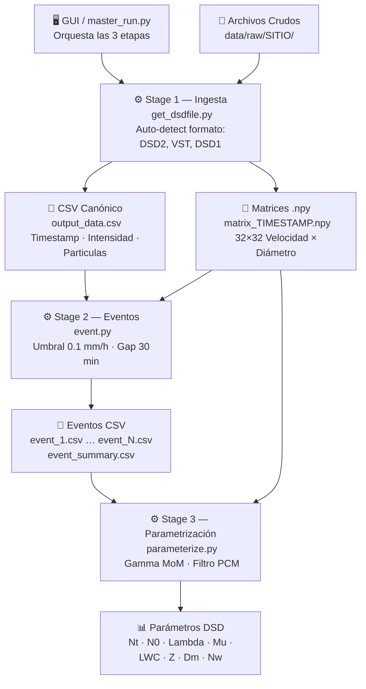

# DSD App

Aplicación para procesamiento de datos de Parsivel DSD (Drop Size Distribution).
Incluye tres etapas: ingesta de datos crudos, identificación de eventos de lluvia y parametrización Gamma de la DSD.

---

## Pipeline



---

## Instalación

### Con conda (Recomendado)

```bash
git clone https://github.com/LuciaSandalio/dsd_app.git
cd dsd_app
conda env create -f environment.yml
conda activate dsd_app
```

### Con pip y venv

**Linux / macOS:**
```bash
python3 -m venv .venv
source .venv/bin/activate
pip install --upgrade pip
pip install -r requirements.txt
```

**Windows:**
```powershell
py -3.9 -m venv .venv
.\.venv\Scripts\Activate.ps1
pip install --upgrade pip
pip install -r requirements.txt
```

---

## Configuración

```bash
# Linux / macOS
cp config/config.example.yaml config/config.yaml

# Windows
Copy-Item config\config.example.yaml config\config.yaml
```

Editar `config/config.yaml` para ajustar:
- `start_date` / `end_date` — rango de fechas a procesar
- `run.sites` — lista de sitios (ej: `bosque_alegre`, `villa_dique`, `pilar`)
- `paths` — directorios de entrada/salida si difieren del default

---

## Ejecución

### Pipeline completo (recomendado)

```bash
python src/scripts/master_run.py
```

Opciones:
```bash
python src/scripts/master_run.py --site bosque_alegre --start-date 2025-01-01 --end-date 2025-01-31
python src/scripts/master_run.py --stage 1   # Solo ingesta
python src/scripts/master_run.py --stage 2   # Solo eventos
python src/scripts/master_run.py --stage 3   # Solo parametrización
```

### Interfaz gráfica (GUI)

```bash
python src/scripts/gui_launcher.py
```

### Etapas individuales

| Etapa | Script | Descripción |
|-------|--------|-------------|
| 1 | `src/scripts/get_dsdfile.py` | Ingesta archivos crudos → CSV canónico + matrices `.npy` |
| 2 | `src/scripts/event.py` | Identifica eventos de lluvia |
| 3 | `src/scripts/parameterize.py` | Parametrización Gamma (Mu, Lambda, N0, Dm, Nw) |

---

## Notas de compatibilidad

- **Zona horaria:** se incluye `tzdata`, no hace falta instalar nada extra en Windows.
- **Rutas:** el código usa `pathlib.Path`, por lo que podés usar `/` en `config.yaml` en cualquier sistema operativo.
- **Multiproceso:** los scripts ya incluyen el guard `if __name__ == "__main__"` necesario para `ProcessPoolExecutor` en Windows.
